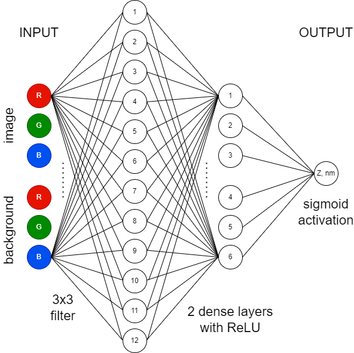

# CV2D 
## Computer-vision enabled "digital AFM"

CV2D converts optical images of hBN flake to height profiles.
It uses simple 2-layer dense neural network based on the tensotflow platform.


## Requirements
Tensorflow 2.3.0 is required for this project. It requires python 3.5, 3.6, 3.7, or 3.8.
Simple way to ensure correct version is installed is to create separate environment
```
conda env create --file environment.yml
conda activate cv2d
```
or equivalently
```
conda create -y -n cv2d python=3.8.15 tensorflow==2.3.0
conda activate cv2d
```
If you want to use this environment in jupyter-lab, create kernel assosiated with this python environment
```
pip install --user ipykernel
python -m ipykernel install --user --name=cv2d
```
After you've installed tensorflow module try running the script with test image (provide no arguments)
```
python cv2d.py
```



## Usage
You need to provide flake image and background image. For example,
```
python cv2d.py input/img1.jpeg input/bkg1.jpeg
```
You may also specify background color in RGB format using square brackets:
```
python cv2d.py input/img1.jpeg "[175, 115, 155]"
```
Result is saved to `output<#>` folder.
Keep in mind, that non-square images are automatically rescaled.
You may open grayscale image with Gwyddion and provide z-scaling.